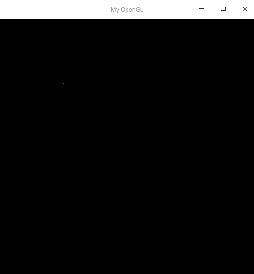
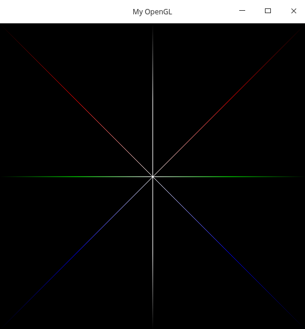

# Exercicio 1 - Introdução a Computação Grafica (ICG)

## Respositorio do primeiro Exercício de ICG

### Centro de Informatica - Universidade Federal da Paraiba

 Disciplina: Introdução a Computação Grafica

 Discente: Wagner Dantas Garcia - wagnergarcia@cc.ci.ufpb.br

 Data de Criacao: 24/06/2020

### Introdução

A ideia desse projeto é introduzir os alunos aos conceitos de introdução a computação grafica, ministrada pelo Prof. Dr. Christian Azambuja Pagot. Onde foi desenvolvida a rasterização de pontos, linhas e triangulos, onde foi utilizada a biblioteca grafica OpenGL Para isso foi utilizado uma base de codigo do Prof. Dr. Christian Azambuja Pagot, onde o codigo emulava a criação de uma memoria de video.

### Desenvolvimento

  O projeto foi dividido em três partes importantes, sendo elas o desenvolvimentos das principais funções, putPixel(), DrawLine() e DrawTriangle(); para isso foram criados duas estruturas para auxiliar no desenvolvimento do programa e assim ficar mais facil e pratico o desenvolvimento sendo elas a color, a point, a line e a triangle.

#### Estruturas

##### Color

  A color tem a função de agrupar os elementos de uma cor em um vetor de 4 elementos de ponto flutuante, `color[4]`, onde o primeiro elemento do vetor[0] seria resevado para a cor vermelha (Red), o Segundo elemento do vetor[1] a cor verde (Green), o terceiro elemento do vetor[2] a cor azul (Blue), e por fim no ultimo elemento do vetor[3] será armazenado o valor da cor alfa. É nescessário ser ponto flutuante pois se não for não tem como calcular a interpolação entre as cores.

  ``` 
  color.c = {R,G,B,A}
  ```

  
##### Point

  A estrutura point ele irá armazenar dois valores inteiros para guardar a posição do ponto no espaço, um deles irá armazenar o valor da posição X e o outro da posição Y, além disso teremos uma estrutura color dentro dela que irá armazenar a cor do ponto.

``` 
x = inteiro
y = inteito
cor = color
```

##### Line

Com a estrutura line armazenamos os pontos iniciais e finais de uma linha, utilizando um vetor de `point` de dois elementos armazenamos os pontos da linha o primeiro o inicial e o segundo o final.

```
Pontos[2] = {Ponto Inicial, Ponto Final}
```

##### Triangle

Na estrutura triangle armazenamos os vertices de um triangulo similar a estrutura line, a diferença é que na estrutura triangle armazenamos um vetor de `point` de três posições, assim guardando todos os vertices do triangulo a ser utilizado.

```
Triangulo[3] = {Vertice 1, Vertice 2, Vertice 3}
```

#### Funções 

##### putPixel()

Foi desenvolvido uma função chamada `putPixel()` onde sua principal função era desenhar pontos na tela. onde ela irá receber como parametros um `point`e a saida seria desenhar na tela um ponto naquela cordenada e cor.

Sabemos que na memoria a informação de um pixel é armazenada em 4 bytes, onde o primeiro é destinado a cor vermelha, o segundo a cor verde, o terceiro a cor azul e o ultimo ao alfa. Temos que um pixel é seguido do outro na memoria assim eles são armazenados sequencialmente.

Então para calcularmos a posição de um pixel prescisamos de suas cordenadas. Através das coordenadas do pixel calularemos a sua posição na memoria, como cada ponto ocupa 4 bytes então pegaremos a posição X do pixel e multiplicaremos por 4 e para a posição Y será calculada por sua posição vezes 4 vezes a largura da tela. dessa forma encontraremos a primeira posição na memoria para aquele pixel, para encontrarmos as outras 3 prescisamos somar só mais um byte para cada cor. 
``` 
posição R = 4 * PosiçãoX + 4 * LarguraDaTela * PosiçãoY
posição G = 4 * PosiçãoX + 4 * LarguraDaTela * PosiçãoY + 1
posição B = 4 * PosiçãoX + 4 * LarguraDaTela * PosiçãoY + 2
posição A = 4 * PosiçãoX + 4 * LarguraDaTela * PosiçãoY + 3
```
Assim que encontramos as posições de cada cor para aquele ponto armazenamos na memoria o valor correspondente a cada cor, como a cor armazenada está na forma de ponto flutuante prescisamos transforma-lá em ponto inteiro para que possa ser armazenada de forma correta na memoria, para assim que o programa for execultado ele possa desenhar na tela a cor correspondente a cada pixel.



##### drawLine()

Na função `drawLine()` tem a finalidade de desenhar retas na tela utilizando a função `putPixel()` para realizar essa tarefa ela irá execultar o algoritmo de Bresenham dos pontos medios para calcular os pixels a serem desenhados. Essa é a principal função do projeto, pois ela que irá calcular todas as linhas a serem desenhada. Para isso ela recebe como parametro `line` que será a linha a ser plotada na tela e irá plotar na tela todos os pontos dessa linha e sua respectiva cor. Para isso ela irá utilizar além do algoritmo de Bresenham um algoritmo para calcular as cores desses pontos a serem plotados e assim fazer a interpolação se for nescessário. 

###### Algoritmo de Bresenham

O algoritmo de bresenham consistem em calcular os pontos de uma reta com base no ponto medio entre dois pixels e por onde a reta passa, se abaixo dele ou acima dele. Desse modo consiguimos plotar todos os pontos da reta e assim plota-la por completo. 

Primeiro temos que calcular as diferenças entre os pontos, a diferença no eixo X e a diferença no eixo Y. 

```
Dx = PontoFinal.x - Ponto Inicial.x
Dy = PontoFinal.y - Ponto Inicial.y
```

Tendo a diferença em maõs podemos calcular o incremento ponto medio para o proximo ponto, e os incrementos a leste, `x++`, e a nordeste,`x++ e y++`. Os valores irão depender se a reta tem uma crescente maior em x,Dx > Dy, ou uma crescente maior em y, Dy > Dx.

Para a crescente em x temos que:

```
Ponto Médio = 2 * Dy - Dx
Incremento a leste = 2 * Dy
Incremento a Nordeste = 2 * (Dy - Dx)
```

Para a Crescente em Y temos que:

```
Ponto Médio = 2 * Dx - Dy
Incremento a leste = 2 * Dx
Incremento a Nordeste = 2 * (Dx - Dy)
```

Com esses calculos em mãos iremos armazenar o valor do primeiro ponto a ser desenhado em um `point` auxiliar chamado desenho e plotar ele na tela. Apartir de agora iremos inicializar um loop onde irá calcular todos os pontos da reta até chegar no ponto final no eixo com maior crescente. A principel iremos incrementar a variavel que está em crescente, iremos verificar se o valor do ponto medio é menor que 0, se for iremos incrementa-lo a leste, se não for iremos incrementar a variavel que não ta em crescente e o ponto medio para nordeste. Por fim iremos atualizar a posição do ponto auxiliar e plota-lo na tela.

###### Algoritmo de Interpolação

No algoritmo de interpolação iremos calcular a diferença entre os canais de cores para saber qual é a variança que cada cor prescisa receber para fazer a interpolação entre uma e outra, calculamos esse valor pegando o valor do canal escolhido do ponto final e subritaindo ele pelo valor do mesmo canal escolhido do ponto inicial e dividindo pela crescente de eixo maior.

Os canais de cores são o Red(Vermelho), Green(Verde), Blue(Azul) e Alfa.

``` 
diferençaCanalR = (Ponto Final Canal R - Ponto Inicial CanalR) / Dx ou Dy
diferençaCanalG = (Ponto Final Canal G - Ponto Inicial CanalG) / Dx ou Dy
diferençaCanalB = (Ponto Final Canal B - Ponto Inicial CanalB) / Dx ou Dy
diferençaCanalA = (Ponto Final Canal A - Ponto Inicial CanalA) / Dx ou Dy
```

Tendo essa diferença em mão quando formos plotar o ponto auxiliar no algoritmo de Bresenham iremos somar dentro do ciclo a esse auxiliar as diferenças de canais para assim conseguir fazer a interpolação de forma correta.



##### drawTriangle()

A função `drawTriangle()` irá desenhar triangulos na tela sem preenchimento, utilizando a função `drawLine()` será desenhado as três arestas do triângulo, conectadas aos vertices. Recebemos como parametro um `triangle`, e o retorno é plotar na tela todos os pontos corespondentes as arestas do triangulo.

Para isso utilizaremos a função `drawLine()`, de forma que iremos criar uma linha para cada aresta que interliga-rá os vertices do triângulo. Então a primeira linha interliga-rá os vertices 0 e o 1, a segunda os vertices 0 e 2, a terceira os vertices 1 e 2. com as linhas desenhadas utilizamos a função `drawLine()` para desenha-las na tela.


