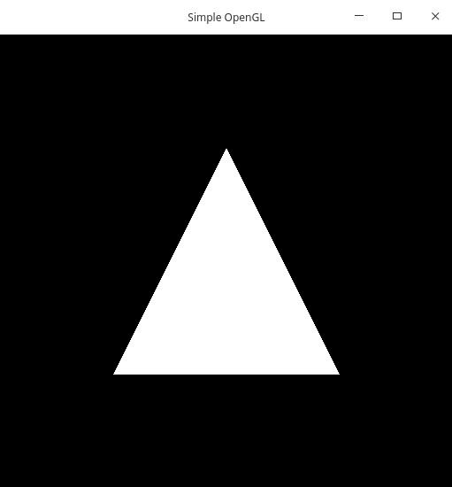
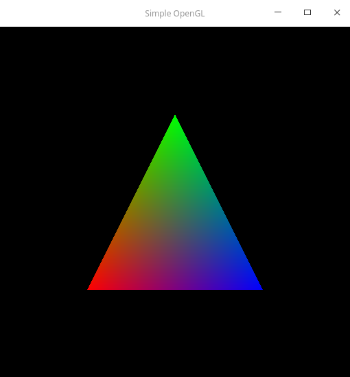
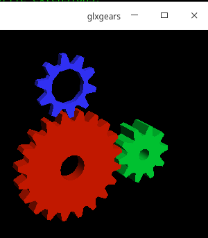

# Exercicio 2 - Introdução a Computação Grafica (ICG)

## Respositorio dos Exercícios de ICG

### Centro de Informatica - Universidade Federal da Paraiba

 Disciplina: Introdução a Computação Grafica

 Discente: Wagner Dantas Garcia - wagnergarcia@cc.ci.ufpb.br

 Data de Criacao: 24/06/2020

 ### Introdução

 Nesse segundo exercicio teriamos que verificar se o nosso sistema conseguiria execultar o OpenGL 3.3. Para fazer isso compilamos o programa que o Prof. Dr. Christian Azambuja Pagot disponibilizou.

 ### Desenvolvimento

 A minha placa gráfica é integrada a Intel Graphics 4000 e só execulta até o OpenGL 3.0, então foi nescessário instalar o Mesa 18.1.9 para emular a placa grafica e fazer todo o processamento que seria feito via hardware, será feita por software. 



 Mesmo instalando o Mesa, quando foi compilado o programa ele não estava aplicando a textura ao triangulo. Ao pesquisar no Starkoverflow encontrei pessoas com o mesmo problema e lá verifiquei que a execultar um comando o codigo ao ser compilado seria utilizado pelo mesa e assim aplicar a textura.

 ```export MESA_GL_VERSION_OVERRIDE=3.3```

 Com essa linha de comando consegui exportar o codigo funcionando perfeitamente e chegar ao resultado esperado que é o do triangulo com a sua textura.

 

 ### Conclusão

 Ao fim desse exercicio foi adquirido o conhecimento sobre compilação de OpenGL e a execulsão do Mesa para assim conseguir emular todos os codigos sem nescessáriamente ter uma placa de vídeo especifica.

 ### Referencias

 STACK Overflow: MESA_GL_VERSION_OVERRIDE is not changing version string in Ubuntu 18.04 with nouveau. [S. l.], 17 set. 2019. Disponível em: https://stackoverflow.com/questions/52592309/0110-error-glsl-3-30-is-not-supported-ubuntu-18-04-c. Acesso em: 30 jun. 2020.

 