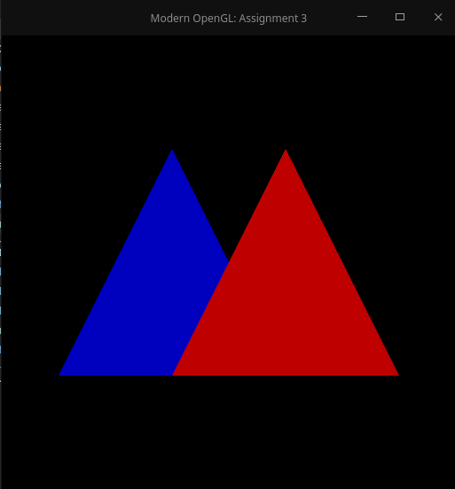
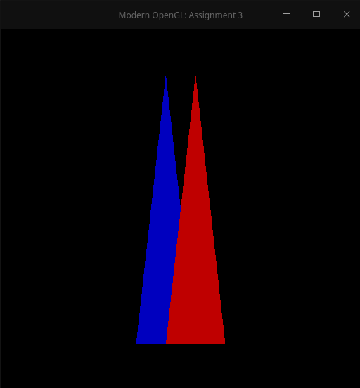
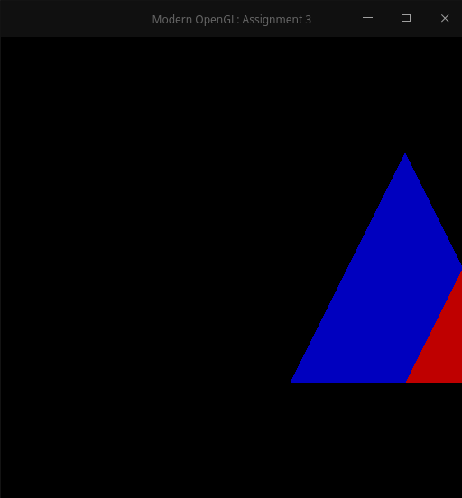
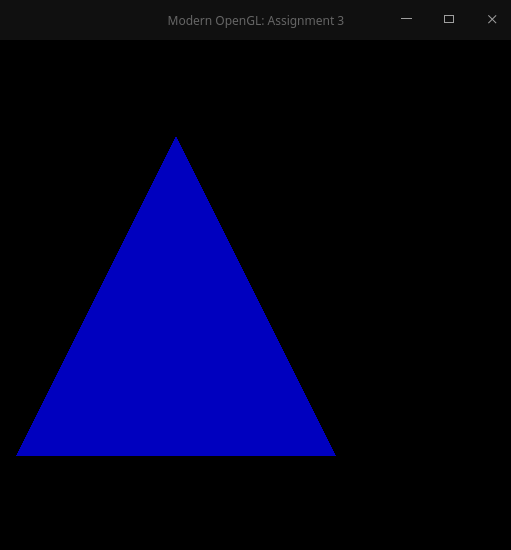
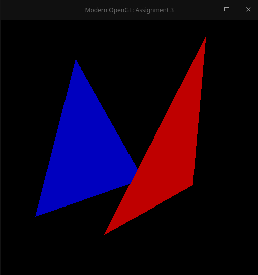
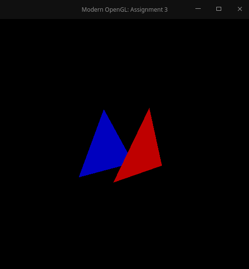
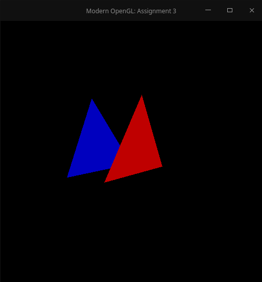
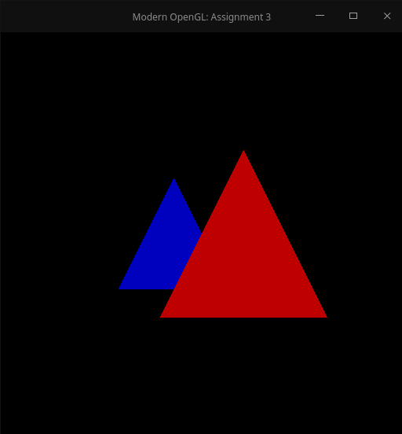

# **Exercicio 3 - Introdução a Computação Grafica (ICG)**

## Respositorio dos Exercícios de ICG

### **Centro de Informatica - Universidade Federal da Paraiba**

 Disciplina: Introdução a Computação Grafica

 Discente: Wagner Dantas Garcia - wagnergarcia@cc.ci.ufpb.br

 Data de Criacao: 24/06/2020

### **Introdução**

Na computação grafica uma das partes mais importantes são as rasterização de cenarios e espaços.
Ao rasterizarmos qualquer coisa prescisamos migrar entre os mais diversos espaços para no fim plotar pontos na tela.

Para realizar essa atividade são gerados varios espaços onde os objetos vão passando de um espaço para o outro. Sendo esses espaços; espaço do objeto, espaço do Universo, espaço da Camera, Espaço de Recorte, Espaço Canônico e Espaço de Tela.

### **Desenvolvimento**

Iniciamos o trabalho compilando o codigo e verificando se as devidas bibliotecas estavam inclusas que são a GLM e a GLEW, ao instalar essas bibliotecas conseguimos chegar a esse resultado depois de compilado:

Após isso foi alterando a matriz model que é a que faz a passagem dos objetos do espaço do objeto para o espaço da camera, e mantendo todas as outras como identidade. De forma que ela deformasse o objeto 1/3 em X, 3/2 em Y e 1 em Z, assim foi presciso alterar a matriz model para que ao objeto passar por ela ele ficasse com a deformação pedida, Então a matriz model ficou da seguinte forma: 

$$
Model = 
\begin{bmatrix}
    0.5f    &   0.0f    &   0.0f            &   0.0f \\
    0.0f    &   1.5f    &   0.0f            &   0.0f \\
    0.0f    &   0.0f    &   1.0f            &   0.0f \\
    0.0f    &   0.0f    &   0.0f            &   1.0f \\
\end{bmatrix}
$$

Com essa matriz conseguiremos o objetivo e o objeto será protado da forma pedida, como é mostrado abaixo.

Para a segunda atividade todas as matrizes foram carregadas como identidade, apenas a model foi alterada, para essa atividade era para fazer uma translação no eixo X de uma unidade e manter o y e o z sem translação, então para fazer isso temos que modificar a mesma matriz model para que seja feita a translação. de forma que a matriz fica da seguinte forma:

$$
Model = 
\begin{bmatrix}
    1.0f    &   0.0f    &   0.0f            &   0.0f \\
    0.0f    &   1.0f    &   0.0f            &   0.0f \\
    0.0f    &   0.0f    &   1.0f            &   0.0f \\
    1.0f    &   0.0f    &   0.0f            &   1.0f \\
\end{bmatrix}
$$

Com essa matriz conseguiremos o objetivo e o objeto será protado da forma pedida, como é mostrado abaixo.

Na Atividade 3 teriamos que fazer uma transformação pespectiva para da sentido de profundidade as imagens geradas, de forma que o triangulo azul teria que aparecer menor que o vermelho porque ele está mais longe. para isso deveriamos utilizar a matriz de projeção para fazer essa modificação, porém ao gerar os graficos foi percebido que ao utilizar a matriz de projeção como descrita não funcionou, nela a coordenada homogenea é tratada como 0, porém ao renderizar mantendo as outras matrizes como identidade não funciona. Primeiramente foi gerado graficos com as seguinte matriz. 

$$
Projection = 
\begin{bmatrix}
    1.0f    &   0.0f    &   0.0f            &   0.0f \\
    0.0f    &   1.0f    &   0.0f            &   0.0f \\
    0.0f    &   0.0f    &   1.0f            &  -2.0f \\
    0.0f    &   0.0f    &   0.5f            &   0.0f \\
\end{bmatrix}
$$

Porém o resultado obtido não foi satisfatorio. ficou como o abaixo.

Ao colocar a coordenada homogenea como 1 foi conseguido o resultado esperado de forma que a matriz e o resultado ficou igual ao abaixo:

$$
Projection = 
\begin{bmatrix}
    1.0f    &   0.0f    &   0.0f            &   0.0f \\
    0.0f    &   1.0f    &   0.0f            &   0.0f \\
    0.0f    &   0.0f    &   1.0f            &  -2.0f \\
    0.0f    &   0.0f    &   0.5f            &   1.0f \\
\end{bmatrix}
$$

Na atividade 4 constatamos o mesmo problema do anterior na matriz projection, porém nessa atividade teremos que alterar a matriz view, que é a matriz que guarda as posições da camera. Primeira mente foi calculado o eixo Z da camera, pelo norma negativa do eixo direção da camera.

$$
Zcam = \frac{d}{|d|}
$$

Após isso foi calculado o eixo x atravez da norma do produto vetorial do eixo Zcam e up da camera. 

$$
Xcam = \frac{UP X Zcam}{|UP X Zcam|}
$$

por fim foi calculado o eixo Y pelo mesmo principio do anterior.

$$
Ycam = \frac{Zcam X Xcam}{|Zcam X Xcam|}
$$

por fim ao calcular todos os eixos da camera foi gerado a matriz view, onde foi colocado os eixos da camera e a deslocação da camera no espaço. de forma que a matriz ficou da seguinte forma.

$$
View = 
\begin{bmatrix}
    0.93f   &   0.13f    &   -0.35f     &   0.0f \\
    0.0f    &   0.94f    &   0.35f      &   0.0f \\
    0.37f   &   -0.32f   &   0.87f      &   0.0f \\
    0.1f    &   -0.1f    &   -0.25f     &   1.0f \\
\end{bmatrix}
$$

Temos dois resultados um com sem a cordenada homogena na matriz projection e outro com a coordenada homogenea, Respectivamente:

Na atividade 5 temos que trabalhar as 3 matrizes, e tentei encontrar uma forma de ulizar a matriz projection da forma certa, sem a coordenada homogenea, então para isso fui ter que alterar a matriz as matrizes, que ficaram da seguinte forma:

$$
Model = 
\begin{bmatrix}
    1.0f    &   0.0f    &   0.0f            &   0.0f \\
    0.0f    &   1.0f    &   0.0f            &   0.0f \\
    0.0f    &   0.0f    &   1.0f            &   0.0f \\
    0.0f    &   0.0f    &   -0.5f            &   1.0f \\
\end{bmatrix}
$$

$$
Projection = 
\begin{bmatrix}
    1.0f    &   0.0f    &   0.0f            &   0.0f \\
    0.0f    &   1.0f    &   0.0f            &   0.0f \\
    0.0f    &   0.0f    &   1.0f            &  -2.0f \\
    0.0f    &   0.0f    &   0.5f            &   0.0f \\
\end{bmatrix}
$$

$$
View = 
\begin{bmatrix}
    0.93f   &   0.13f    &   -0.35f     &   0.0f \\
    0.0f    &   0.94f    &   0.35f      &   0.0f \\
    0.37f   &   -0.32f   &   0.87f      &   0.0f \\
    0.1f    &   -0.1f    &   -0.25f     &   1.0f \\
\end{bmatrix}
$$

Com essas matrizes conseguimos resolver o problema da coordenada homogenea na matriz projection e temos o seguinte resultado: 

E com a matriz view contendo a matriz identidade chegamos a este resultado:

### **Conclusão**

Essa atividade foi importante pois atrávez dela podemos aprender as transformações matriciais e gerar imagens com essas transformações. 

### **Referencias**

DO ESPAÇO do objeto (modelagem) ao espaço canônico – Rasterizador C/C++. [S. l.], 19 fev. 2013. Disponível em: https://bitunico.wordpress.com/2013/02/19/do-espaco-do-objeto-modelagem-ao-espaco-canonico-rasterizador-cc/. Acesso em: 12 ago. 2020.

Material de estudo. Prof. Christian Azambuja Pagot.